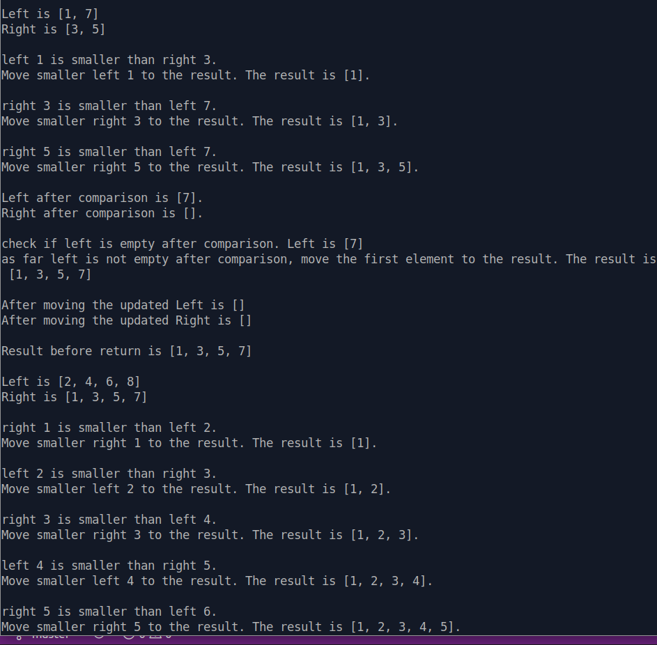

After watching all background videos provided, it was not very challenging to write a Merge Sort algorithm. Could it be that the original idea behind the assignment was NOT to watch the background videos before writing the code? well... if it's so... I've cheated.

As far as a lot of experienced peers from ODIN community have suggested to get more familiar with debuggers to understand how a program will behave given certain inputs and as far as the best way to understand recursion is to trace the execution flow with pen and paper, it was a perfect assignment to start going dipper with `pry`.

There is a ton of articles, videos, guides, how-to's, tips etc on how to use `pry` on [wikipry](https://github.com/pry/pry/wiki) and on [Google](https://www.google.com/search?client=ubuntu&hs=4G4&channel=fs&ei=GRgKX56KNMy56QTmzoH4Dw&q=how+to+use+pry+with+ruby&oq=how+to+use+pry+with+ruby&gs_lcp=CgZwc3ktYWIQAzIGCAAQFhAeMgYIABAWEB4yBggAEBYQHjoHCAAQRxCwAzoFCAAQkQI6AgguOgIIADoICC4QxwEQowI6CggAEJECEEYQ-QE6BQguEJMCOggIABAWEAoQHlDGFljUNmDWOGgCcAB4AIABgwGIAaMUkgEENy4xN5gBAKABAaoBB2d3cy13aXqwAQA&sclient=psy-ab&ved=0ahUKEwje-oGy_MXqAhXMXJoKHWZnAP8Q4dUDCAs&uact=5). And it's true `pry` is an absolute beast of a tool and offers a plethora of advanced features. Nobody argues on that! The question is how to access them? Easy, they say, put a `binding.pry` in the part of the code that isn’t working as expected, cause that line of code to be executed, and then poke around in the session in your terminal... What if nothing happens??? What if you place your breakpoint, run your code, and instead of landing inside `pry` terminal, nothing happens? 

The best answer I found on the web is 
> *"While this may be frustrating, it does give a clue. It means that your code never triggered the Pry because it never got that far. So what do you do? You set a new breakpoint earlier in the code and see if that works. While this may seem tedious, it is actually giving you important information!"*
> -[Melissa Williams](https://www.honeybadger.io/blog/debugging-ruby-with-pry/) - 

So, just move the `binding.pry` one line to the top and try to run your file again. If it still doesn't catch it, move the `binding.pry` one more line to the top and keep doing this until your file catches the `binding.pry`. By doing this you will know which line of code causes the problem.

What if you place your breakpoint, run your code, land inside `pry` terminal and find yourself in infinite loop without possibily to type anything in the console if not `!!!` to get out of it???

Here are a couple of advices found on [Medium](https://medium.com/@akedalat/troubleshooting-weird-behaviours-of-pry-in-ruby-f3d2fa93b854)

> "*Don’t write `binding.pry` at the last line of your source code. If this is the case, always write a short expression after, something simple like `puts "Testing Pry"` would do fine."*

> *"If it still doesn’t catch it then your code has either Compile-time errors, (Syntax and Type errors), Link-time errors (found by the linker) or Run-time errors (when the programme runs)"*

And is here where I'm frustrated... Within your `Pry` console you have all the features of this world to inspect state or introspect your program, but you can't access them until you fix your code. How to fix your code? Use a debugger! And we're in infinite loop as a `binding.pry` in our code...

As far as I don't know and I haven't found any other solution than to use an old good `puts` to help see what's going on in the code. It's not beautiful, it's tedious, it's simple and effective... 

<!--  -->

but the major part of them is about `pry` 
I've read and watched everything available on [wikipry](https://github.com/pry/pry/wiki), I've googled and found (obivously) some very useful articles and guides... 

order to understand recursion better is very useful pen and paper to visualize each move of code, so I was thinking could `pry` be that digital pen and paper? 

and as far as debugging is something that I'm probably going to do for the rest of my coding life

The best way to get proficient in recursion is to practice it as much as possible
## `pry`

### Using pry in Loops
Using the conditional, you can specify at what point you want to intercept your code and initiate a pry session.
`binding.pry if value.nil?`

[source](https://www.honeybadger.io/blog/debugging-ruby-with-pry/)
### Setting breakpoints with Pry
Let’s say you’re having a really hard time getting your code to run the way you expected. (We’ve all been there, right?)

What you can do is set a breakpoint in the part of the code that isn’t working as expected and then you’ll end up in a version of Pry, but at a point that is frozen.
Set the binding.pry right above the line of code that is causing the trouble and then run the code. 

### What if nothing happens?

Sometimes you’ll place your breakpoints, run your code, and instead of landing inside Pry, nothing seems to happen. While this may be frustrating, it does give a clue. It means that your code never triggered the Pry because it never got that far. So what do you do? You set a new breakpoint earlier in the code and see if that works. While this may seem tedious, it is actually giving you important information!

### When to ask for help
Set your breakpoints with Pry and dig deeper into the code. If after 20-30 minutes you're no closer to finding a solution, it might be time to ask for assistance.